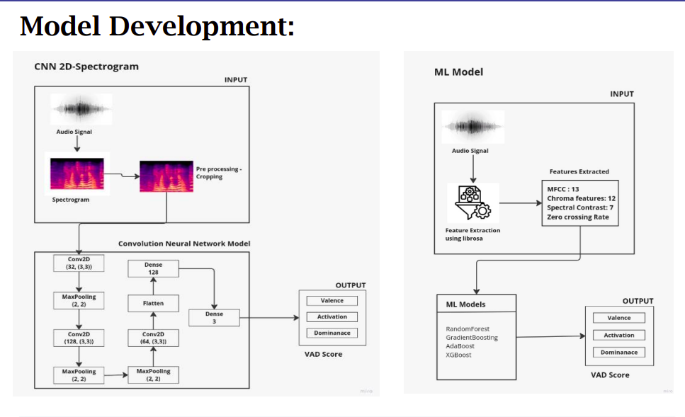
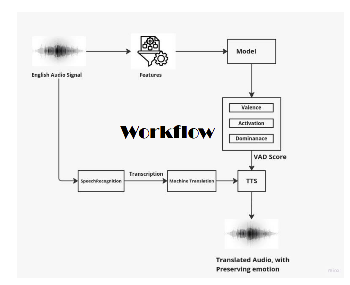
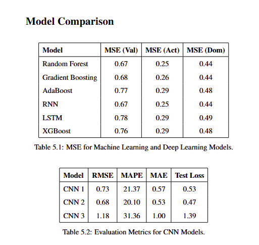
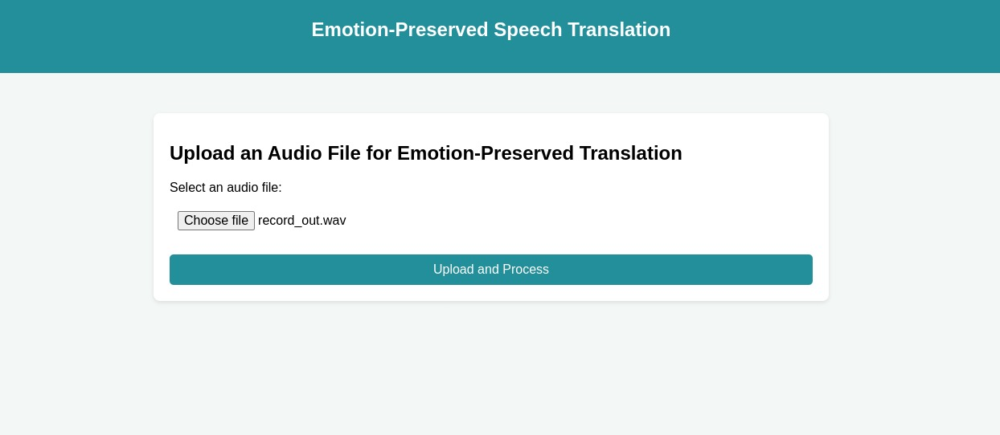

# Estimating Emotion from Speech Signals for Emotion Preserving Translation. 

## 1. Conda env setup 

```
conda create -n pycp -y python=3.10.10             
```

```
conda activate pycp
``` 

## 2. Jupyter Notebook 

```
pip install jupyterlab
```
- to open Jupyterlab 

```
jupyter lab
```

## 3. Model Development 




## 4. Workflow 




## 5. Result Analysis 



## 6. To run Application - translation 

```
cd my-app
```

- Install all the required packages 

```
python app.py
```

### Application 



## Contributors

- Bagiya Lakshmi ([GitHub](https://github.com/bagiyalakshmi))
- Cynddia Balamurugan ([GitHub](https://github.com/Cynddia))
- Harini C J  ([GitHub](https://github.com/Harinijayagopinath))
- Chunduri Suhasini ([GitHub](https://github.com/Suhasini02))

